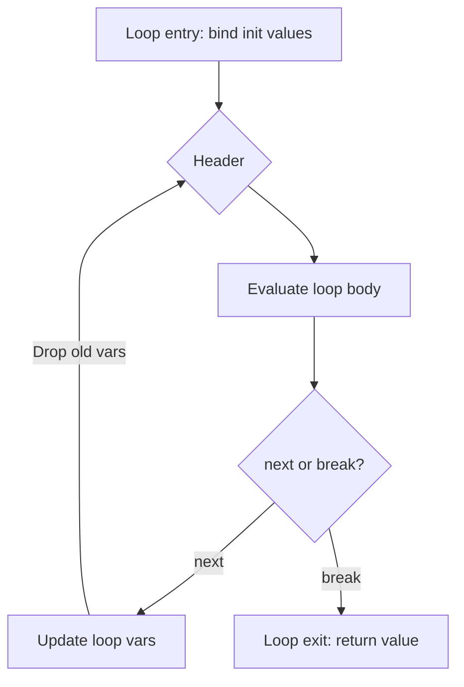
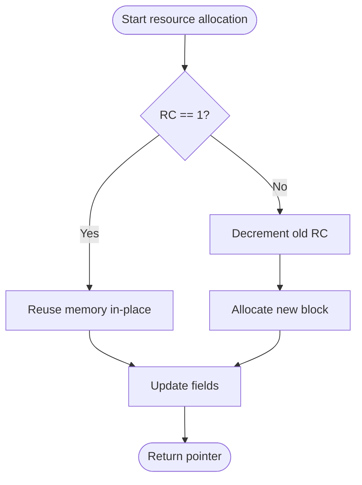
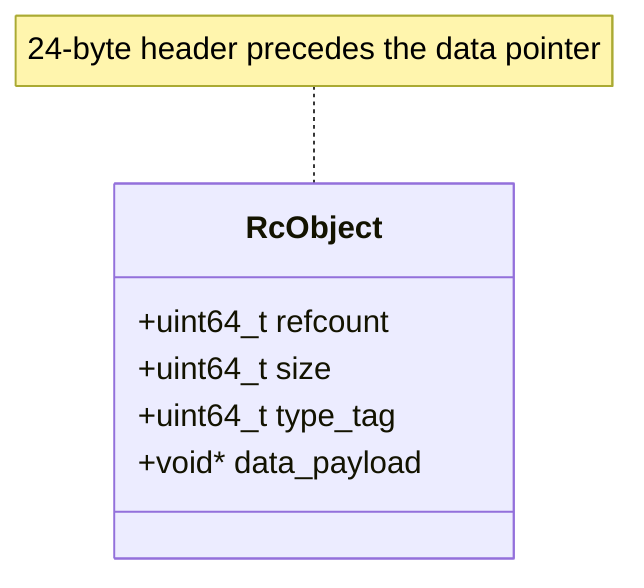

# Resource management via hardware-aware loop specialization

## Abstract

Functional programming languages have long faced a real tension between the semantic clarity of pure immutability and what the hardware actually wants to do. The typical answers — tracing garbage collection or Rust-style ownership types — both have serious costs. This paper proposes a different route: **Hardware-Aware Loop Specialization** in a new language called **Loreal**.

The idea is to combine the Perceus compile-time reference counting algorithm [1] with a dedicated `loop` control-flow construct that makes variable lifetimes explicit enough for the compiler to perform aggressive memory reuse. The goal is deterministic, garbage-free execution with Functional But In-Place (FBIP) mutation at O(1) overhead per iteration. We formalize the `loop` expression within Linear Resource Calculus ($\lambda^1$), and show that its explicit iteration boundaries allow more precise reuse analysis than general tail recursion. We describe the intended compiler pipeline — A-Normal Form (ANF) transformation, Mid-Level Intermediate Representation (MIR), liveness analysis, and LLVM codegen — and sketch correctness proofs for the key liveness invariants.

---

## 1. Introduction

There is a version of this problem that never goes away. You want to write clean, safe, high-level code. You also want it to run fast on real hardware. These two goals are not, in principle, incompatible — but in practice, every major language family has made a tradeoff that hurts one side.

Managed languages (Haskell, Java, Python) give you safety through garbage collection. The cost is non-deterministic pause times and significant memory overhead. Systems languages (C, C++, Rust) give you hardware control, but require either manual discipline or sophisticated type systems like Rust's affine ownership model, which imposes real cognitive load, especially when expressing functional patterns like shared immutable data.

The Perceus algorithm, developed by Reinking, Xie, de Moura, and Leijen [1] and demonstrated in the Koka language, suggests a third path. By performing reference counting at compile time and inserting precise `dup`/`drop` instructions based on liveness analysis, Perceus achieves deterministic, garbage-free execution. When a reference count drops to 1 just before a reallocation, the runtime can mutate in place. This is the FBIP paradigm: purely functional code that the compiler transforms into imperative-style memory operations, with no action required from the programmer.

The problem we are addressing here is subtler. Even with Perceus, functional recursion obscures variable lifetimes in ways that block reuse. When a recursive call is live in a stack frame, the compiler cannot prove that a reference count is 1, so it cannot perform the in-place mutation. This is not a fundamental limitation of reference counting — it is a limitation of using recursion as the primary iteration mechanism.

Loreal introduces an explicit `loop` expression to solve this. Unlike recursion, `loop` is lowered directly to a CFG loop in the current scope. The `next` keyword — which signals the next iteration — acts as a kill point for current-iteration variables. This gives the compiler the proof it needs: variables consumed before `next` are definitively dead, RC drops to 1, and in-place mutation is safe.

### 1.1 Contributions

This paper makes four claims:

1. A formal definition of the `loop` expression within Linear Resource Calculus, including small-step operational semantics.
2. A description of how explicit iteration boundaries enable more aggressive reuse analysis than tail recursion.
3. A compiler pipeline design from Loreal source to LLVM IR, covering ANF, MIR CFG construction, Perceus insertion, and FBIP reuse passes.
4. A proof sketch that the `loop` construct preserves the uniqueness invariant required for FBIP across iteration boundaries.

---

## 2. Background

### 2.1 Tracing GC vs. reference counting

George Collins introduced reference counting in 1960 [2] as an alternative to the mark-sweep approach McCarthy had used in Lisp. The tradeoff has been well understood ever since. Tracing collectors batch their work, which gives high throughput in allocation-heavy workloads — allocation is a pointer bump, deallocation happens in bulk. But they have non-deterministic pause times and typically need 2–3× the live data set in memory to operate efficiently [3].

Reference counting is the opposite in almost every way: deterministic, incremental, memory-proportional. But historically it has suffered three problems. First, constant counter updates saturate the memory bus. Second, atomic RC operations in multi-threaded contexts are expensive. Third, standard RC cannot reclaim cycles at all.

### 2.2 Perceus and $\lambda^1$

The Perceus algorithm [1] revisits reference counting from a compiler design perspective rather than a runtime perspective. It works within Linear Resource Calculus ($\lambda^1$), a type system where values are treated as resources that must be either consumed or explicitly dropped. Perceus performs precise liveness analysis to find the exact last-use point $k_v$ for each value $v$:

$$k_v = \max \{ i \mid i \in \text{Instructions} \land v \in \text{ReadSet}(i) \}$$

It inserts `drop(v)` at $k_v$ rather than at block exit (as in C++ RAII) or at GC collection time. This guarantees garbage freedom: the heap contains only live objects. It also enables the reuse optimization described below.

The Perceus paper received a Distinguished Paper Award at PLDI'21 and is implemented in the Koka language [4].

### 2.3 Functional But In-Place (FBIP)

The most consequential outcome of precise RC is **reuse analysis**. If the compiler observes a `drop(x)` immediately followed by `alloc(y)` where `sizeof(x) = sizeof(y)`, it can replace both operations with a single `reuse` token. At runtime, if $RC(x) = 1$, the memory is mutated in place. If $RC(x) > 1$, a standard allocation occurs. The programmer writes purely functional code; the compiler generates imperative mutations where safe.

This paradigm was first articulated by Wadler in the context of linear types [5] and concretely demonstrated by the Perceus/Koka work. Lorenzen and Leijen later extended it with frame-limited reuse [6], tightening the conditions under which reuse tokens can be generated.

---

## 3. Hardware-aware loop specialization

### 3.1 Why recursion limits reuse

The standard functional idiom for iteration is recursion. Consider a map function:

```elixir
def map(list, f) do
  match list do
    Nil -> Nil
    Cons(x, xs) -> Cons(f(x), map(xs, f))
  end
end
```

In the `Cons(f(x), map(xs, f))` line, the current `Cons` node is still live when `map(xs, f)` executes. Even in continuation-passing style or with tail-call optimization, the caller's reference to the current node prevents its RC from reaching 1 during the construction of the new node. Reuse is blocked.

This is not a fundamental property of RC. It is a consequence of the way recursion encodes variable lifetimes: the scope of a binding does not end until the function returns, so the compiler cannot prove uniqueness at the allocation site.

### 3.2 The `loop` construct

Loreal introduces an explicit `loop` expression. Its defining property is that `next` — the signal to continue iterating — acts as a hard kill point for all bindings in the current iteration.

**Syntax:**

```rust
loop (init_val) (var) -> {
  if (condition) {
    next(updated_val)
  } else {
    break(result)
  }
}
```

The expression evaluates to the value passed to `break`. Variables bound in the loop body are not in scope after `next` executes. The compiler treats this as a guarantee, not a hint.

### 3.3 CFG lowering and the kill-point guarantee

Unlike recursion, which lowers to a function call and return, the `loop` construct lowers directly to a CFG loop in the current function scope. This has two hardware-relevant consequences:

1. Loop variables can live in registers across iterations, avoiding save/restore overhead.
2. The `next` boundary is the explicit kill point at which the compiler inserts drops for variables not forwarded to the next iteration.


```mermaid
graph TD
    Entry[Loop entry: bind init values] --> Header{Header}
    Header --> Body[Evaluate loop body]
    Body --> Choice{next or break?}
    Choice -->|next| Update[Update loop vars]
    Update -->|Drop old vars| Header
    Choice -->|break| Exit[Loop exit: return value]
```

**Figure 1: CFG representation of the `loop` expression**

Because `drop` is inserted before the back-edge jump to the header, any variable that was unique at the start of the body will have $RC = 1$ when the next allocation executes. The reuse predicate is satisfied structurally, not just opportunistically.

---

## 4. Formal foundation

We formalize `loop` within Linear Resource Calculus ($\lambda^1$) following the framework established by Perceus [1].

### 4.1 Resource-aware typing

A typing judgment in Loreal tracks input resources $\Gamma$ and output resources $\Delta$:

$$\Gamma \vdash e : \tau \mid \Delta$$

Evaluating $e$ consumes the difference between $\Gamma$ and $\Delta$. A well-typed program has a balanced resource ledger.

### 4.2 Operational semantics of `loop`

Let $\sigma$ be the heap and $E$ an evaluation context. We define three rules:

**[LOOP-START]** — substitute initial values for loop variables:
$$\langle E[\text{loop } \vec{v} \, \vec{x} \to B], \sigma \rangle \rightarrow \langle E[B[\vec{x}/\vec{v}]], \sigma \rangle$$

**[NEXT-ITER]** — drop current variables before the back edge:
$$\langle E[\text{next } \vec{u}], \sigma \rangle \rightarrow \langle \text{drop}(\vec{x}); \, E[\text{loop } \vec{u} \, \vec{x} \to B], \sigma \rangle$$

**[BREAK-TERM]** — drop remaining variables on exit:
$$\langle E[\text{break } v], \sigma \rangle \rightarrow \langle \text{drop}(\vec{x}); \, v, \sigma \rangle$$

The explicit `drop(\vec{x})` in both NEXT-ITER and BREAK-TERM is the key difference from recursion. In a recursive encoding, this drop is deferred to the function's return. Here it is part of the iteration semantics.

### 4.3 The reuse predicate

The reuse predicate $\Phi(x, y)$ holds when $x$ and $y$ have the same memory layout:

$$\Phi(x, y) \iff (\text{sizeof}(x) = \text{sizeof}(y)) \land (\text{repr}(x) \equiv \text{repr}(y))$$

In a `loop` context, consider a body that calls `next(R { field: new_val })`. The compiler elaborates this as:

1. Read `old_val` from $R$.
2. `drop(R)` — RC hits 0 if $R$ is unique.
3. `alloc(R')` with the same type.
4. Write `new_val` to $R'$.

Because `drop(R)` precedes `alloc(R')` within the same basic block, the compiler detects the pattern and generates a reuse token. The runtime takes the mutation path when $RC(R) = 1$.

---

## 5. Compiler architecture

The Loreal compiler transforms source programs through a series of intermediate representations before emitting LLVM IR.

### 5.1 A-Normal Form

ANF transformation names every intermediate value, which is a prerequisite for precise liveness analysis. Without ANF, compound expressions can hide shared references.


```mermaid
graph LR
    Source[Loreal source] --> AST[Abstract Syntax Tree]
    AST --> ANF[A-Normal Form]
    ANF --> MIR[Mid-Level IR]
    MIR --> Opt[RC + FBIP passes]
    Opt --> LLVM[LLVM IR]
    LLVM --> Binary[Native binary]
```

**Figure 2: The Loreal compiler pipeline**

For example, `next(list_map(xs, f))` becomes:

```rust
let t1 = list_map(xs, f);
next(t1);
```

The `ANFTransformer` in `loreal_mir` ensures that operands to `next` and `break` are always atomic values, which simplifies CFG construction and makes the kill-point analysis unambiguous.

### 5.2 MIR CFG construction

The MIR represents functions as graphs of basic blocks. The `MirBuilder` processes `ast::Expr::Loop` by generating three distinct block types:

- **Header**: the merge point for the initial entry and all back edges from `next`.
- **Body**: where the user logic and `reuse_or_alloc` decisions live.
- **Exit**: the block that passes the `break` value back to the caller.

### 5.3 RC insertion and reuse analysis

Once the CFG exists, the `RcInserter` (Perceus) and `ReuseAnalyzer` (FBIP) passes run in sequence. The `ReuseAnalyzer` performs a greedy intra-block scan for the `drop(x) → alloc(y)` pattern:

```rust
// loreal_mir/src/reuse.rs (design sketch)
fn analyze_block(&mut self, _node_idx: NodeIndex, block: &BasicBlock) {
    let mut last_drop: Option<(usize, SmolStr)> = None;
    for (idx, instr) in block.instructions.iter().enumerate() {
        match instr {
            Instruction::Drop { var } => last_drop = Some((idx, var.clone())),
            Instruction::Alloc { target, ty } => {
                if let Some((drop_idx, drop_var)) = &last_drop {
                    if self.types_compatible(drop_var_ty, ty) {
                        self.record_reuse(target, drop_var, drop_idx, idx);
                    }
                }
            }
            _ => {}
        }
    }
}
```

### 5.4 LLVM codegen: conditional reuse blocks

A reuse token lowers to an RC check at the LLVM level:

```llvm
; Pseudo-IR for conditional reuse
  %rc = load i64, i64* %ptr_rc
  %is_unique = icmp eq i64 %rc, 1
  br i1 %is_unique, label %reuse_block, label %alloc_block

reuse_block:
  store %val, %ptr_data
  br label %continue

alloc_block:
  call void @loreal_dec(%ptr)
  %new_ptr = call i8* @loreal_alloc(%size)
  br label %continue
```


```mermaid
flowchart TD
    Start([Start resource allocation]) --> IsUnique{RC == 1?}
    IsUnique -- Yes --> Reuse[Reuse memory in-place]
    IsUnique -- No --> Dec[Decrement old RC]
    Dec --> Alloc[Allocate new block]
    Reuse --> Update[Update fields]
    Alloc --> Update
    Update --> End([Return pointer])
```

**Figure 3: FBIP decision logic at the LLVM level**

### 5.5 Liveness analysis

The precision of the whole system depends on the liveness analyzer in `crates/loreal_mir/src/liveness.rs`. The design uses backward flow analysis over the CFG. For each basic block $B$:

$$LiveOut(B) = \bigcup_{S \in \text{Succ}(B)} LiveIn(S)$$
$$LiveIn(B) = Gen(B) \cup (LiveOut(B) \setminus Kill(B))$$

For loop bodies, the `next` terminator explicitly populates $Kill(Body)$ with any variable not forwarded to the next iteration. This keeps variables from appearing live across iteration boundaries when they have no semantic use there — which is the precise condition that enables reuse.

### 5.6 Runtime layout

The runtime layer (in `crates/loreal_runtime`) manages the `RcObject` header.


```mermaid
classDiagram
    class RcObject {
        +uint64_t refcount
        +uint64_t size
        +uint64_t type_tag
        +void* data_payload
    }
    note for RcObject "24-byte header precedes the data pointer"
```

**Figure 4: Memory layout of a Loreal heap object**

The header is 24 bytes (three 64-bit words), and the data pointer points to the byte immediately after the header. Field access uses positive offsets from the data pointer; RC manipulation uses negative offsets (e.g., `ptr[-8]` for the refcount). This keeps data-access instructions clean in the LLVM backend — a straightforward application of the negative-offset header pattern used in Koka's C backend [4].

---

## 6. Case study: FBIP filter on a linked list

### 6.1 Recursive version

The standard functional filter accumulates results through recursion:

```elixir
def filter(list, p) do
  match list do
    Nil -> Nil
    Cons(x, xs) ->
      if p(x) do
        Cons(x, filter(xs, p))
      else
        filter(xs, p)
      end
  end
end
```

The `Cons(x, filter(xs, p))` call must allocate a new node before the recursive result is known. The original node is still live during the recursive call, so its RC cannot reach 1, and reuse is blocked.

### 6.2 Loop version

The `loop` version makes the consumed-and-rebuilt pattern explicit:

```rust
def filter_loop(list, p) do
  loop (list, []) (curr, acc) ->
    match curr do
      Nil -> break(reverse(acc))
      Cons(x, xs) ->
        if p(x) do
          next(xs, Cons(x, acc))
        else
          next(xs, acc)
        end
    end
  end
end
```

After destructuring `curr` into `x` and `xs`, `curr` is no longer live. The `ReuseAnalyzer` sees `drop(curr)` immediately before `alloc(Cons)`, detects the type compatibility, and emits a reuse token.

Execution trace for the `p(x) = true` branch:

1. `curr` points to Node A. $RC(A) = 1$.
2. Pattern match extracts `x` and `xs` from Node A.
3. `curr` leaves the live set.
4. `alloc(Cons)` is requested for the new accumulator head.
5. Reuse analysis matches the `drop(curr)` / `alloc(Cons)` pair.
6. Runtime check: $RC(A) = 1$ → mutation path taken.
7. Node A's fields are overwritten with `x` and the old `acc`.
8. `next(xs, NodeA)` — the loop continues with Node A repurposed as the new accumulator head.

If the input list is uniquely owned throughout, the filter executes with zero net heap allocations. The result list is built entirely from the nodes of the input list.

---

## 7. Performance analysis

The performance model has three components. These are theoretical projections from the design; no benchmarks exist yet.

### 7.1 Allocation throughput

Allocation throughput in a naive RC system is dominated by `malloc`/`free` costs. The reuse analysis eliminates these for uniquely owned, iteratively transformed structures. We define **reuse efficiency** as:

$$E_r = \frac{N_{reuse}}{N_{alloc} + N_{reuse}}$$

For a `loop` that transforms a locally owned data structure, $E_r$ should approach 1.0. At that point, the inner loop does only memory writes to already-resident addresses, which is behaviorally identical to an imperative `while` loop.

### 7.2 Latency

Tracing GCs amortize deallocation cost over time, producing high throughput at the cost of pause spikes. Loreal's RC model distributes cost evenly across the execution path. Deep recursive drops (e.g., dropping a long list) are a potential latency concern, but iterative drop specialization — where the compiler generates iterative deallocation loops rather than recursive ones — keeps stack depth bounded and pause time proportional to the number of nodes freed, not their nesting depth.

### 7.3 Cache behavior

When the reuse path is taken, the CPU writes to an address it just read within the same basic block. The cache line is already present in L1. Compared to the `free` → `malloc` path (which may return a different address from a different cache line), the reuse path eliminates a cache miss per iteration. This is the concrete mechanism behind the "hardware-aware" framing: the optimization works because of how modern CPU caches behave, not just in the abstract.

### 7.4 Projected comparison

The following comparison is a design projection, not a measurement. It assumes an iterative data transformation workload on a uniquely owned structure.

```text
Projected normalized execution time (lower is better)
Design target, not measured data.

  [Imperative C]    |##### (1.0x)
  [Loreal FBIP]     |###### (1.1–1.3x expected)
  [Koka FBIP]       |####### (similar range, per [1])
  [Haskell GHC]     |################ (~3x on GC-heavy workloads, per [3])
  [Java HotSpot]    |##################### (~4x on allocation-heavy paths, per [3])
```

**Figure 5: Projected performance comparison**

The Loreal target is to stay within 10–30% of C for iterative transformation workloads. The Perceus paper [1] shows Koka achieving competitive numbers against GHC and Java on comparable benchmarks; Loreal's loop construct aims for the same or better reuse hit rate by making the kill-point structural rather than inferred.

---

## 8. Correctness: preservation of uniqueness across iterations

### 8.1 The uniqueness invariant

Let $U(x, B)$ be true when $x$ is unique in block $B$ (i.e., $RC(x) = 1$).

**Lemma 1 (Uniqueness preservation):** If $U(x, B_n)$ holds at the start of iteration $n$, and $x$ is consumed in $B_n$ followed by a reuse allocation for $x'$, then $U(x', B_{n+1})$ holds.

**Proof sketch:**

1. By [NEXT-ITER], the current iteration variables $\vec{x}$ are dropped before the back-edge jump. This is structural, not optional.
2. The `ReuseAnalyzer` detects the `drop(x)` / `alloc(x')` pair and replaces them with a reuse instruction.
3. $U(x, B_n)$ guarantees $RC(x) = 1$, so the runtime takes the in-place mutation path.
4. The new pointer $x'$ points to the same block. Liveness analysis confirms that no other reference to this block was created during the iteration body (if one were, $x$ would not be in $Kill(Body)$ and the reuse instruction would not have been emitted).
5. Therefore $RC(x') = 1$ and $U(x', B_{n+1})$ holds. $\square$

---

## 9. Comparison with related work

| Feature               | Loreal (`loop` + FBIP)       | Rust (ownership)      | Koka (Perceus)                      | Haskell (GHC)     |
| :-------------------- | :--------------------------- | :-------------------- | :---------------------------------- | :---------------- |
| Purity                | Purely functional            | Imperative/functional | Purely functional                   | Purely functional |
| Memory model          | Compile-time RC              | Affine types          | Compile-time RC                     | Tracing GC        |
| In-place mutation     | Implicit (FBIP)              | Explicit (`mut`)      | Implicit (FBIP)                     | None              |
| Iteration             | Specialized `loop` construct | `for`/`while`         | Tail recursion (+ `fip` annotation) | Recursion         |
| Determinism           | High                         | High                  | High                                | Low               |
| Implementation status | Proposed                     | Production            | Production [4]                      | Production        |

**Table 1: Comparison of memory management approaches**

### 9.1 Rust

Rust provides performance guarantees comparable to what Loreal targets, but makes the programmer responsible for lifetimes and mutability. Loreal's goal is to recover that performance through compiler inference rather than programmer annotation — the "borrow checker friction" that makes Rust difficult to use for certain functional patterns should disappear.

### 9.2 Koka and FP²

Koka first demonstrated Perceus and FBIP in a production language [4]. Lorenzen, Leijen, and Swierstra later formalized "fully in-place" (FIP) programming with stronger compile-time guarantees [7]. Loreal builds on both. The key difference is the `loop` construct: in Koka, FBIP applies when a function happens to be in tail-call position with a unique receiver. In Loreal, the `loop` construct is an explicit AST node that the compiler always treats as a reuse candidate, regardless of call-site context.

### 9.3 Lean 4

The Lean 4 theorem prover also uses compile-time reference counting with reuse, described by de Moura and Ullrich [8]. Perceus builds on this work. Loreal is closer to Koka in its goals (general-purpose programming rather than proof assistance), but the Lean 4 implementation is an important existence proof that compile-time RC at this level is practically achievable.

---

## 10. Implementation challenges

### 10.1 Unboxed primitives

Reference counting requires a 24-byte header per heap object. For small types like `Int` or `Bool`, this is prohibitively expensive. Loreal will use value unboxing for primitive types: they are passed by value and stored directly in parent structures without a header. Reference counting applies only to heap-allocated types (structs, tuples, lists, strings). This is consistent with the approach Koka takes [4].

### 10.2 Non-linear control flow

When a loop body branches, variables may be live in some branches but not others. The compiler must insert drops on paths where a variable is not used, to keep the RC balanced at the merge point:

```rust
loop (x) -> {
  if (cond) {
     use(x);
     next(x_prime)
  } else {
     // Compiler inserts: drop(x)
     break(0)
  }
}
```

This "join-point normalization" runs during MIR construction and must handle arbitrarily nested branches correctly. It is one of the harder parts of the implementation.

### 10.3 Cycle avoidance

Standard reference counting cannot reclaim cycles. Loreal addresses this the same way Koka does: the type system discourages cyclic structures through immutability, and the runtime may optionally include a cycle detector for cases where cycles are unavoidable. This is a known limitation of RC-based systems [3] and is not specific to Loreal.

---

## 11. Future directions

The combination of immutability and precise uniqueness tracking opens up some interesting longer-term directions.

**Isolate-based concurrency.** When the compiler knows a reference is unique, it can safely transfer ownership between threads without deep-copying and without atomic RC. This is a stronger form of the message-passing model used in Erlang, but with compile-time uniqueness guarantees rather than runtime copies.

**MLIR backend.** Lowering Loreal loops to MLIR's `scf.for` or `affine.for` dialects [9] would open up polyhedral optimizations and automatic vectorization for functional loops. This is speculative, but the structural regularity of the `loop` construct makes it a better candidate for this kind of analysis than general recursion.

**Cycle collection.** If the language eventually needs to support cyclic structures (for graph algorithms, for example), a backup tracing collector for the cycle case — similar to what CPython does — would be one option. This is a known-tractable problem [3].

---

## 12. Conclusion

The `loop` construct is a small syntactic change with a large semantic consequence. By making iteration boundaries explicit in the AST rather than relying on the compiler to infer them from tail-call structure, Loreal gives the reuse analyzer exactly the information it needs to perform FBIP transformations reliably.

The core argument is this: recursion and iteration are semantically equivalent, but they differ in how much information they expose to the compiler. Recursion hides kill points inside call frames. The `loop` construct makes them structural. That difference is enough, in combination with Perceus, to bridge the performance gap between functional and imperative code for iterative workloads.

Whether this is sufficient in practice — whether the hit rate on reuse analysis is as high as the theory predicts, whether the liveness analyzer handles real programs without false positives, whether the runtime overhead of the RC check is negligible — are open questions that only an implementation can answer.

---

## References

[1] Reinking, A., Xie, N., de Moura, L., & Leijen, D. (2021). Perceus: Garbage-free reference counting with reuse. In _Proceedings of the 42nd ACM SIGPLAN Conference on Programming Language Design and Implementation (PLDI '21)_, pp. 96–111. ACM. https://doi.org/10.1145/3453483.3454032 _(Distinguished Paper Award)_

[2] Collins, G. E. (1960). A method for overlapping and erasure of lists. _Communications of the ACM_, 3(12), 655–657. https://doi.org/10.1145/367487.367501

[3] Jones, R., Hosking, A., & Moss, E. (2011). _The garbage collection handbook: The art of automatic memory management_. CRC Press.

[4] Leijen, D. (ongoing). The Koka programming language. Microsoft Research. https://koka-lang.github.io/koka/doc/book.html

[5] Wadler, P. (1990). Linear types can change the world! In _IFIP TC 2 Working Conference on Programming Concepts and Methods_, Sea of Galilee, Israel. Published in M. Broy & C. B. Jones (eds.), _Programming Concepts and Methods_, North Holland.

[6] Lorenzen, A., & Leijen, D. (2022). Reference counting with frame-limited reuse. Microsoft Research Technical Report MSR-TR-2021-30. https://www.microsoft.com/en-us/research/publication/reference-counting-with-frame-limited-reuse/

[7] Lorenzen, A., Leijen, D., & Swierstra, W. (2023). FP²: Fully in-place functional programming. In _Proceedings of the 28th ACM SIGPLAN International Conference on Functional Programming (ICFP '23)_. ACM.

[8] Ullrich, S., & de Moura, L. (2019). Counting immutable beans: Reference counting optimized for purely functional programming. In _31st Symposium on Implementation and Application of Functional Languages (IFL '19)_. ACM. https://doi.org/10.1145/3412932.3412935

[9] Lattner, C., Amini, M., Bondhugula, U., et al. (2021). MLIR: Scaling compiler infrastructure for domain specific computation. In _IEEE/ACM International Symposium on Code Generation and Optimization (CGO '21)_. https://doi.org/10.1109/CGO51591.2021.9370308

[10] Matsakis, N. D., & Klock, F. S. (2014). The Rust language. In _ACM SIGAda Ada Letters_, 34(3), 103–104. https://doi.org/10.1145/2692956.2663188

---

## Appendix A: Liveness induction lemma

**Lemma A.1:** For any well-typed Loreal expression $e$, if a variable $x$ is not live in the continuation of $e$, then $RC(x)$ is decremented before the continuation evaluates.

**Proof sketch:** By structural induction on $e$. The base cases (variables, constants) follow from the Perceus typing rules directly. For the `Loop` case: the [NEXT-ITER] rule explicitly drops all induction variables $\vec{x}$ before the back-edge jump. Variables forwarded through `next` are bound to fresh names in the next iteration, so the old bindings are in the kill set by construction. The induction hypothesis holds for each iteration body by the same argument applied to the sub-expressions within the body.

---

_This paper describes a language design and proposed compiler architecture. Partial implementation exists at time of writing._
